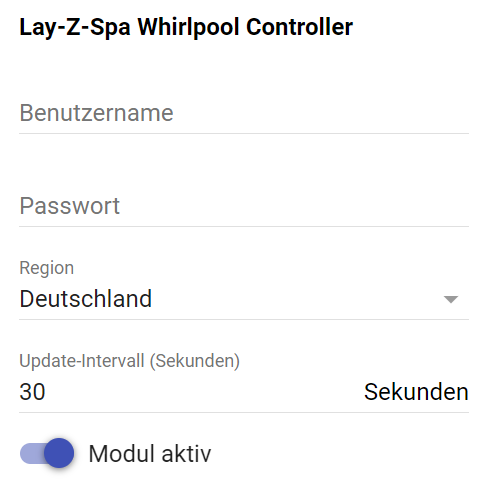

[](https://www.symcon.de/service/dokumentation/entwicklerbereich/sdk-tools/sdk-php/)

[](https://www.paypal.me/adrianschmidt1121)
# IPSymcon Lay-Z-Spa

**Inhaltsverzeichnis**

1. [Funktionsumfang](#1-funktionsumfang)  
2. [Voraussetzungen](#2-voraussetzungen)  
3. [Installation](#3-installation)  
4. [Funktionsreferenz](#4-funktionsreferenz)
5. [Konfiguration](#5-konfiguration)  
6. [Statusvariablen und Profile](#6-statusvariablen-und-profile)  
7. [Anhang](#7-anhang)
    1. [GUIDs der Module](#guids-der-module)
    2. [Spenden](#spenden)

## 1. Funktionsumfang

Das Modul dient zur Steuerung eines Lay-Z-Spa Whirlpools mit integiertem W-LAN Modul

Aktuelle Features:

- Ein- und Ausschalten der gesamten Pumpeneinheit
- Ein- und Ausschalten der Filterfunktion
- Ein- und Ausschalten der Heizung
- Einstellen der gewünschten Solltemperatur
- Auslesen der aktuellen Wassertemperatur
- Auslesen ob die Heizung gerade aktiv heizt
- Ein- und Ausschalten der HydroJet Düsen
- Ein- und Ausschalten der AirJet Düsen und wahl der Stärke/Stufen ( Stufe 1 und 2 )
- Ausgabe eines Fehlercodes wenn dieser ansteht

## 2. Voraussetzungen

- IP-Symcon 7.0
- Bestway SmartHub Account mit eingebundenem Whirlpool von Lay-Z-Spa

## 3. Installation

### 3.1 Laden des Moduls

Modul im Module Control hinzufügen: https://github.com/Adrian01/IPSymconBestway

### 3.2 Eingabe der Anmeldedaten und Modul aktivieren



Über die Checkbox "Modul aktiv" kann die komplette Funktion des Moduls aktiviert und deaktiviert werden. 

## 4. Funktionsreferenz

 _**Whirlpool Ein-/Ausschalten**_
```php
BW_SetPower(int $InstanceID, bool $state)
```


 _**Filterfunktion Ein-/Ausschalten**_
```php
BW_SetFilter(int $InstanceID, bool $state)
```


 _**Heizung Ein-/Ausschalten**_
```php
BW_SetHeater(int $InstanceID, bool $state)
```


 _**Stellt die Solltemperatur auf den gewünschten Wert ein**_
```php
BW_SetTemperature(int $InstanceID, int $value)
```
Es werden Werte zwischen 20 °C und 40 °C akzeptiert


 _**Schalten der AirJet Düsen auf Stufe 0, 1 oder 2**_
```php
BW_SetAirJet(int $InstanceID, int $value)
```


 _**HydroJet Düsen Ein-/Ausschalten**_
```php
BW_SetHydroJet(int $InstanceID, bool $state)
```


## 5. Statusvariablen

|         Variable           |   Typ   |                                  Beschreibung                                         |
|:--------------------------:|:-------:|:-------------------------------------------------------------------------------------:|
|      Wassertemperatur      | Integer | enthält die aktuelle Wassertemperatur im Pool                                         |
|      Heizung aktiv         | Boolean | gibt an ob die Heizung gerade auch wirklich heizt (Solltemperatur erreicht = inaktiv) |
|      Hardwareversion       | String  | enthält die Hardwareversionsnummer der Pumpeneinheit                                  |
|      Softwareversion       | String  | enthält die Softwareversionsnummer der Pumpeneinheit                                  |
|      Fehlercode            | String  | sollte ein Fehler anstehen, wird dieser hier ausgegeben                               |


## 6. Spenden

Dieses Modul ist für die nicht kommzerielle Nutzung kostenlos, Schenkungen als Unterstützung für den Autor werden hier akzeptiert:    


<a href="https://www.paypal.com/cgi-bin/webscr?cmd=_s-xclick&hosted_button_id=H35258DZU36AW" target="_blank"></a>
